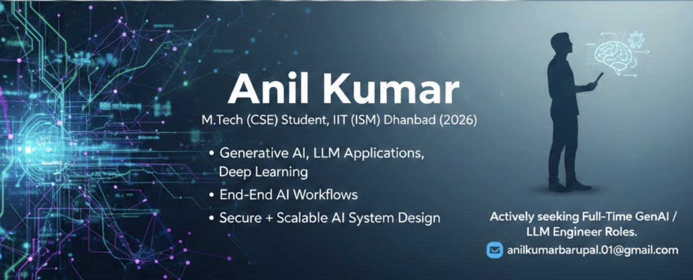

  

<h1 align="center">Anil Kumar</h1>

M.Tech (CSE) student at IIT (ISM) Dhanbad (2026)

  <a href="mailto:anilkumarbarupal.01@gmail.com">anilkumarbarupal.01@gmail.com</a> |
  <a href="https://anilkb.surge.sh/">Portfolio: https://anilkb.surge.sh/</a>

  

## About Me

Hi! Thank you for visiting my profile!

I’m Anil, a final-year M.Tech (CSE) scholar at IIT (ISM) Dhanbad (Class of 2026), focused on bridging the gap between theoretical Deep Learning and practical software engineering. I specialize in building robust Generative AI systems and LLM applications, with a clear philosophy of taking problems from the initial idea phase through data preparation, modeling, and finally to deployment in production environments.

I am actively seeking full-time roles as a GenAI/LLM Engineer, ML Engineer, or Applied Scientist where I can ship impactful AI features. Let’s connect to explore how I can bring performance-oriented problem solving to your engineering team. 

You can reach me at anilkumarbarupal.01@gmail.com.
portfolio websites : https://anilkb.surge.sh/

## Connect with me

## Skills

